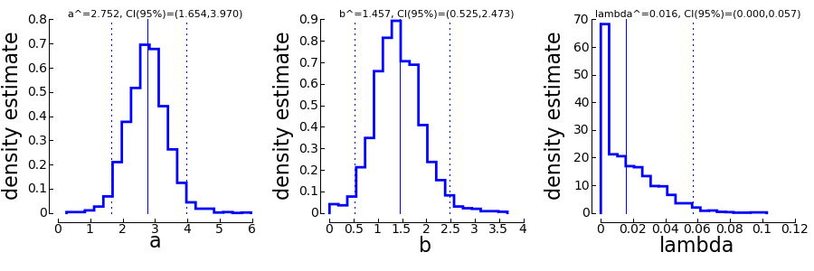
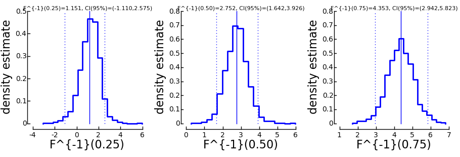

===================================
Additional Plots for the Bootstrap
===================================

In addition to the plots mentioned in the :doc:`tutorial </TUTORIAL>` you can access several other plots in psignifit. 

Parameter Plots
---------------

>>> ParameterPlot(B)

In an interactive session, this should open a window showing the sampling distribution of
the model parameters as shown below (you might have to type show() to see the window).

Each of these plots shows the sampling distribution of the model parameters. In addition,
the estimated parameter is marked by a solid vertical line and the 95% confidence interval is
marked by dotted vertical lines. The confidence interval limits and the estimates are written
on top of the graph.

Threshold Plots
---------------

In some cases, we may not directly be interested in the parameters of the model. Instead, we
ask for "thresholds", that is predefined performance levels of the sigmoid :math:`F`. We can get a plot
of such thresholds and the associated confidence intervals using the function::

>> ThresholdPlot(B)

The image looks essentially the same as for the ParameterPlot only that this time, the threshold(s)
of the model are displayed. 

