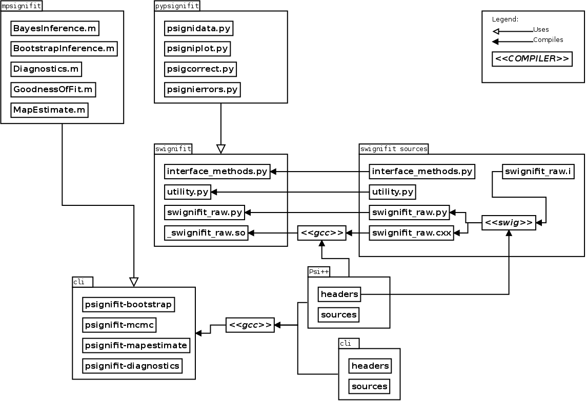

=============================
Contributing to Psignifit 3.0
=============================

psignifit 3.0 is free software. You are free to modify the software under the terms of the license
that is distributed with psignifit 3.0. We welcome developers that want to contribute to psignifit 3.0.

Software Architecture
---------------------

The psignifit 3.x code base is logically split into several components:

:psi++:
    The C++ *engine* of psignifit.
:pypsignifit:
    High level Python interface, including visualisation methods.
:swignifit:
    Python interface to ``psi++`` autogenerated using the ``swig`` tool.
:cli:
    Pure C++ command-line interface to ``psi++``
:rpsignift:
    R interface to ``psi++``.
:mpsignifit:
    MATLAB interface to ``cli``.

We refer to previous versions of psignifit (2.5.6 and before) as
**psignifit-classic**.

The following UML inspired diagram shows the individual components of Psignifit 3.x, and how they relate:

Dependencies
------------

This section lists all dependencies. The version numbers are the Debian versions
we used when we began development, and hence they will probably be outdated by
the time you read this.

Compile-Time
............
* `Make <http://www.gnu.org/software/make/>`_ (3.81-8)
    for building the software
* `Gcc <http://gcc.gnu.org/>`_ (4:4.4.3-1)/
* `Python <python http://www.python.org/>`_ (2.5.5-6)/
* `Python/C API <http://docs.python.org/c-api/>`_ (2.5.5-2)
    for compiling the ``swignifit`` interface for Python
* `Simplified Wrapper and Interface Generator (SWIG) <http://www.swig.org/>`_ (1.3.40-2)
    for generating the ``swignifit`` interface for Python

Run-Time
........
* `Python <python http://www.python.org/>`_ (2.5.5-6)/
* `Numpy <http://numpy.scipy.org/>`_  (1:1.3.0-3)/
* `Scipy <http://www.scipy.org/>`_ (0.7.1-1)/
* `Matplotlib <http://matplotlib.sourceforge.net/>`_ (0.99.1.2-3)
    for the Python version

Documentation
.............

* `sphinx <http://sphinx.pocoo.org/>`_ (0.6.5-1)
    to generate the html documentation
* `doxygen <http://www.stack.nl/~dimitri/doxygen/>`_ (1.6.3-1)
   to generate the C++ documentation
* `epydoc <http://epydoc.sourceforge.net/>`_ (3.0.1-5)
   to generate the Python API documentation

Testing
.......

* `nosetest <http://somethingaboutorange.com/mrl/projects/nose/0.11.2/>`_ (0.11.1-1)
  for running some of the unit tests

Build System
------------

We use a combination of `distutils <http://docs.python.org/library/distutils.html>`_ and `make <http://www.gnu.org/software/make/>`_
to build the software.

There are several ``Makefiles``:

:Makefile:
    main makefile.
:src/Makefile:
    ``psi++`` makefile.
:cli/Makefile:
    ``cli`` makefile.
:cli/MakefileMinGW:
    ``cli`` makefile to compile ``mingw`` for windows.

Note that main makefile contains targets to invoke the ``psi++`` and ``cli``
makefiles. The main targets are ``build``, ``install``, ``clean`` and ``test``.
The main targets will invoke separate targets to build the individual components
of the software. If during development you wish to build components separately,
have a look at the main makefile, it should contain everything you need.

There is a single ``setup.py`` file that can be used to compile and install
``pypsignifit`` including the ``swignifit`` interface. Since the source download
we provide includes the already generated interface, this is the
recommended method of installation for users.

For more information about how to use the ``setup.py`` file, you may look at:
`Installing Pyhon Modules <http://docs.python.org/install/>`_.

Git-Repositories
----------------

We use `Git <http://git-scm.com/>`_ for version control. Our main repository is
hosted at `Sourceforge <http://sourceforge.net/>`_ as `Psignifit
<http://sourceforge.net/projects/psignifit/>`_. Clone the repository
with the following command ::

    git clone git://psignifit.git.sourceforge.net/gitroot/psignifit/psignifit

You can also `browse the Sourceforge repository online
<http://psignifit.git.sourceforge.net/git/gitweb.cgi?p=psignifit/psignifit;a=summary>`_.

We also provide a alternative repository on `Github <https://github.com/>`_:
`https://github.com/esc/Psignifit-3.x <https://github.com/esc/Psignifit-3.x>`_.
This is a mirror of the sourceforge which is updated daily. If you prefer to
use the Github workflow (fork -> clone -> pull-request) please fork from this
repository.

Layout
......

Every developer has his/her own branch, and we use the master branch to do
integration. Hence we have the following layout in the sourceforge repository:

:master:
    the integration branch
:ingo/master:
    Ingo's main branch
:val/master:
    Valentin's main branch

In addition we also make heavy use of short-lived topic branches, which are
deleted after being merged.

All branches except ``master`` are subject to rewind/rebase. So please base you
development either on ``master`` or better yet, on the latest development snapshot(see
below).

Commits
.......

To make it easier to keep track of the development of psignifit, we use the following marks for commits:

* [NF]    new feature
* [BF]    bug fix
* [RF]    refactoring
* [FO]    code formatting (adding spaces etc.)
* [UT]    unit tests
* [DOC]   documentation

We may additionally use the following marks to identify what parts of the code
base we worked on:

* C++
* swig
* py
* R
* build

Merging
.......

For easy tracking of what changes were absorbed during merge, we advice to
enable merge summary within git::

    git-config merge.summary true

Execute without installation
----------------------------

Since it is tedious to install ``pypsignifit`` during development. We provide a
so called in-place compilation. To compile the ``swignifit`` interface without
installation simply type::

    make

You can then run:

>>> import pypsignifit

from the source directory. Furthermore you can use the environment variable
``PYTHONPATH`` in case you need to bring source directory into scope elsewhere
in the filesystem.

Maintainers Notes
-----------------

This section contains notes about the release process. We also support this
process with various ``Makefile`` targets. Since Psignift 3.x is still beta
software we provide so called development snapshots as and when new features and
bugfixes are available.

Development Snapshots
.....................

Development snapshots are made on a regular basis. They consist of the following steps

* make a changelog entry
* create a tarball. The tarball should be named as
  ``psignifit3.0_beta_DD-MM-YYYY.tar.gz``
* create a tag in the git repository. The tag for a snapshot should be
  ``snap-YYYY-MM-DD``
* upload the tarball to sourceforge (into a new folder!)
* push tags

Tags
....

Tags should mark critical points in the development history in the following way:

* ``snap-YYYY-MM-DD`` marks the release of a development snapshot
* ``doc-YYYY-MM-DD`` marks a modification of the documentation that has been uploaded to sourceforge.

Extending
---------

This section contains hints about writing code.

Coding Style
............

We try to adhere to the:
`Numpy Docstring Conventions <http://projects.scipy.org/numpy/wiki/CodingStyleGuidelines#docstring-standard>`_
as far as possible.

Adding a new sigmoid
....................

In principle every part of the library can be replaced. This is generally done by deriving from the fundamental base classes.
An exception is adding a new sigmoid:

Adding a new sigmoid requires two steps:

1. Write a new class that inherits from PsiSigmoid
2. If you want your new sigmoid to work with mwCore objects, you have to add a label for that, too.
    The mwCore class scales the second parameter such that w can be directly interpreted as the
    width of the region in which the sigmoid still rises significantly. What to "rise significantly"
    means is parameterized by the parameter alpha of the mwCore. The default alpha==0.1 indicates
    that w is the width of the range over which the sigmoid rises from 0.1 to 0.9. Thus, the scaling
    of the second parameter obviously depends on the sigmoid.
    The constructor for the mwCore class looks roughly like this::

        mwCore::mwCore ( int sigmoid, double al )
                : sigmtype(sigmoid), alpha(al), zshift(0) {
            switch (sigmoid) {
            case 1:
                ...
                break;
            /////////////// here ////////////////
            default:
                throw NotImplementedError();
            }
        }

    At the position marked by::

        /////////////// here ////////////////

    in the above code example, you should add a new case that defines all the scaling parameters
    depending on your sigmoid. zalpha scales w to the correct range, zshift is an additional
    shift to ensure the the sigmoid has an output value of 0.5 at an input value of 0.

Adding a new source file
........................

When adding a new C++ source or header file you will have to:

* add the file to the git repository
* add the filename to the Makefile
* add the filename to the Python setup file
