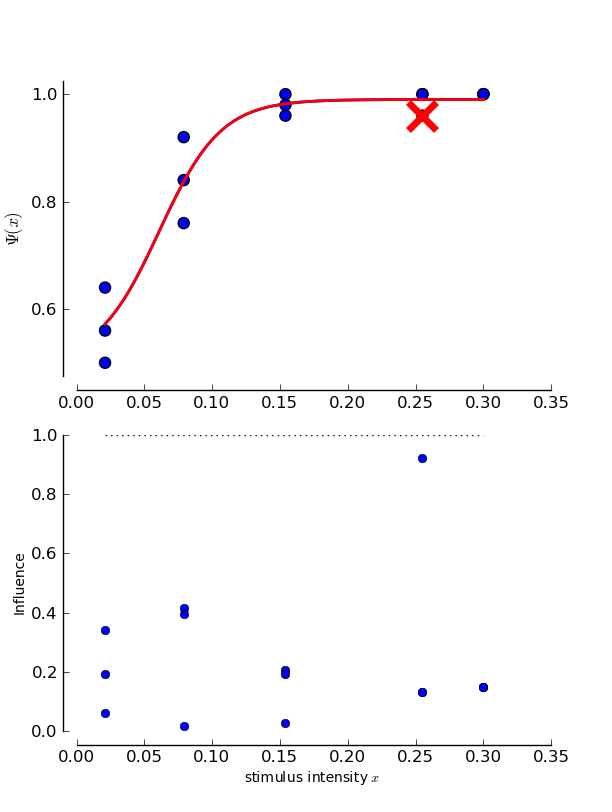
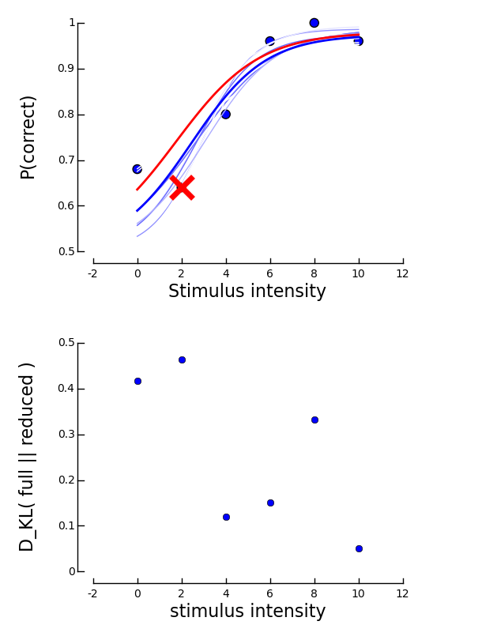

==================================================
Detecting influential observations using psignifit
==================================================

When fitting psychometric functions using psignifit, we usually look for a suitable descriptive model
of our recorded data. Thus, it is of interest to make sure that the psychometric function actually
captures the structure of the whole data set and not of just a single data point. We call a data point
that heavily influences the fitted model an *influential observation*. [Wichmann_and_Hill_2001a]_
suggest to detect influential observations using a sort of jackknife procedure. This strategy
is at the heart a classical frequentist approach to the detection of influential observations.
We will first explain how psignifit implements this procedure and then show how to use a similar
procedure to determine influential observations in Bayesian terms.

If you haven't generated the example dataset named "data_single_sessions", you can find it :doc:`here </QUICKSTART>`.

Influential observations in bootstrapped data
=============================================

The procedure to detect influential observations that was suggested by [Wichmann_and_Hill_2001a]_ starts
with the regular bootstrap confidence intervals as obtained by the bootstrap procedure. We apply this
procedure to the example from the tutorial:
If you haven't created the Bootstrap Inference Object and done the sampling, do:

>>> B_single_sessions = psi.BootstrapInference ( data_single_sessions, priors=("unconstrained","unconstrained","Beta(2,20)"), sample=True )

>>> B_single_sessions.infl.round(2)
array([ 0.34,  0.02,  0.19,  0.13,  0.15,  0.21,  0.43,  0.19,  0.86,
        0.15,  0.06,  0.4 ,  0.02,  0.13,  0.15])

What do these numbers tell us? Obviously, the last block has a relatively high "influence" here, while
the second to last has a lower "influence".

In order to detect influential observations, [Wichmann_and_Hill_2001a]_ suggest to generate a number of
new data sets :math:`\mathcal{D}_k` by leaving out the :math:`k`-th data block. We fit a psychometric function to each of these
new data sets. If the psychometric function fitted to data set :math:`\mathcal{D}_k` is significantly different from the psychometric
function fitted to the whole data set, block :math:`k` is considered influential.
Thus, for a parameter :math:`\theta_i`, we define for dataset :math:`\mathcal{D}_k` the following quantity

If :math:`\theta_i(\mathcal{D}_k) < \theta_i(\mathcal{D})`, where :math:`\mathcal{D}` is the complete dataset

.. math::

    f_{ik} = \frac{\theta_i(\mathcal{D}) - \theta_i(\mathcal{D}_k)}{\theta_i(\mathcal{D}) - c_{2.5\%}(\theta_i,\mathcal{D})}

else

.. math::

    f_{ik} = \frac{\theta_i(\mathcal{D}_k) - \theta_i(\mathcal{D})}{c_{97.5\%}(\theta_i,\mathcal{D}) - \theta_i(\mathcal{D})}

:math:`f_{ik}` is simply the distance between the fit to the whole dataset and the reduced dataset :math:`\mathcal{D}_k`, where the distance
has been scaled such that a value of :math:`f_{ik}=1` indicates that the respective parameter in the reduced dataset
lies precisely on the border of the confidence interval for parameter i in the full data set.
The influence of a data point is then simply defined as the maximum of the :math:`f_{ik}` over all parameters i.
Thus, the relatively high influence of 0.95 for the last block is still not really serious. All parameter
estimates for reduced data sets are still perfectly within the confidence limits of the full data set.

Typcially, we want to visualize the influence of the datapoints to get a quick idea of the influences of the individual
data points. To do so, we can use the plotInfluential() method

>>> psi.plotInfluential(B_single_sessions)

This will give us two plots. The upper plot simply redraws the psychometric function. In addition to the psychometric
function, the data points are shown. To indicate the influence of the strongest data point, this point is marked by
a red x and the fit to the reduced data set is also drawn in red. We can observe here the same things as we noted before:
The last point is marked as the most influential and if it is excluded from the fit, the psychometric function is not seriously
altered.

The plot at the bottom displays an overview over the influence of all data points. In addition to the influence values, there
is a dotted line to mark the point above which psychometric functions fitted to the reduced data set would significantly differ
from the fit to the whole data set.

We can note here that it is reasonable that actually the only serious difference between the fit to the whole data set and
the fit to the reduced dataset might originate from a difference in the lapse rate. (It is as you can see if you calculate
the :math:`f_{ik}` manually). In many cases, the lapse rate is considered a nuissance parameter. Usually what we want to know is more
like "is the whole inference influenced by this one data point". It is difficult to derive a riguorous definition for this
kind of influence in a frequentist setting, even in a relatively data driven frequentist setting such as the employed
bootstrap procedure. However, in a Bayesian setting such an influence measure is readily available.

Influential observations in Bayesian Inference
==============================================

Instead of performing inference on specific values of parameters, i.e. on point estimates, Bayesian inference treats
the whole probability distribution of the parameters after observing the data. This is the reason, why a Bayesian
setting is well adapted to the problem of estimating the influence of a single data point on the whole inference.
We measure the influence of data block k by comparing the posterior distribution given the whole data set to the
posterior distribution of the data set d_k. A suitable measure for the differences between two distributions is the
Kullbach-Leibler divergence. High Kullbach-Leibler divergences indicate large differences between the two distributions
and thus a strong influence of the respective data block, while low Kullbach-Leibler divergences indicate low influence of
the respective data block. Kullbach-Leibler divergence is an information theoretic measure. The exact interpretation of
Kullbach-Leibler divergence would be in terms of optimal coding lengths and can be found in introductury texts
like [Bishop_2006]_.

The influence of data blocks is calculated in terms of Kullbach-Leibler divergence for BayesInference objects.

>>> mcmc = BayesInference ( data, priors=('Gauss(0,5)', 'Gamma(1,3)', 'Beta(2,30)') )
>>> mcmc.infl.round(2)
array([ 0.42,  0.46,  0.12,  0.15,  0.33,  0.05])

We can see here, that the influence of the last data block is rather minor in terms of the changes to the whole
distribution. Thus, Kullbach-Leibler divergence does not necessary give the same results as the bootstrap/jackknife
based procedure described above and suggested by [Wichmann_and_Hill_2001a]_.

We can visualize the data influence again using

>>> plotInfluential(mcmc)

The plot highly resembles the plot obtained for the bootstrap case. At the top, the fitted psychometric function is plotted along
with the data. Again, the most influential data point is marked by a red x and the psychometric function associated with the data
set in which this point was excluded is drawn in red. The get an idea of other typical posterior psychometric functions, 20
sample psychometric functions are drawn in this plot in shades of blue.
We can immediately see, that the red curve is very similar to the blue different blue shaded curves.

The bottom plot displays the Kullbach-Leibler divergences for all blocks. We can observe that the strongest influence on the
posterior distribution is from the block with stimulus intensity 2. Note, however, that a Kullbach-Leibler divergence of 0.46
is still very low.

References
==========

.. [Wichmann_and_Hill_2001a] Wichmann, FA, Hill, NJ (2001a): The psychometric function: I. Fitting, sampling, and goodness of fit. Perc Psychophys, 63(8), 1293-1313.
.. [Bishop_2006] Bishop, CM (2006): Pattern Recognition and Machine Learning. New York: Springer.

