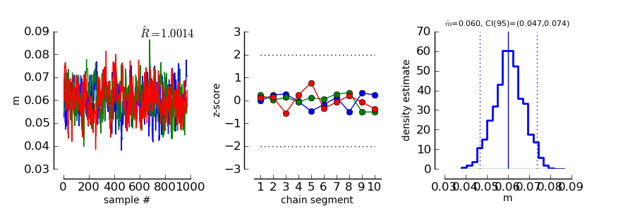
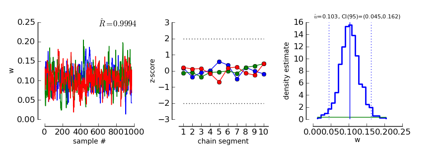
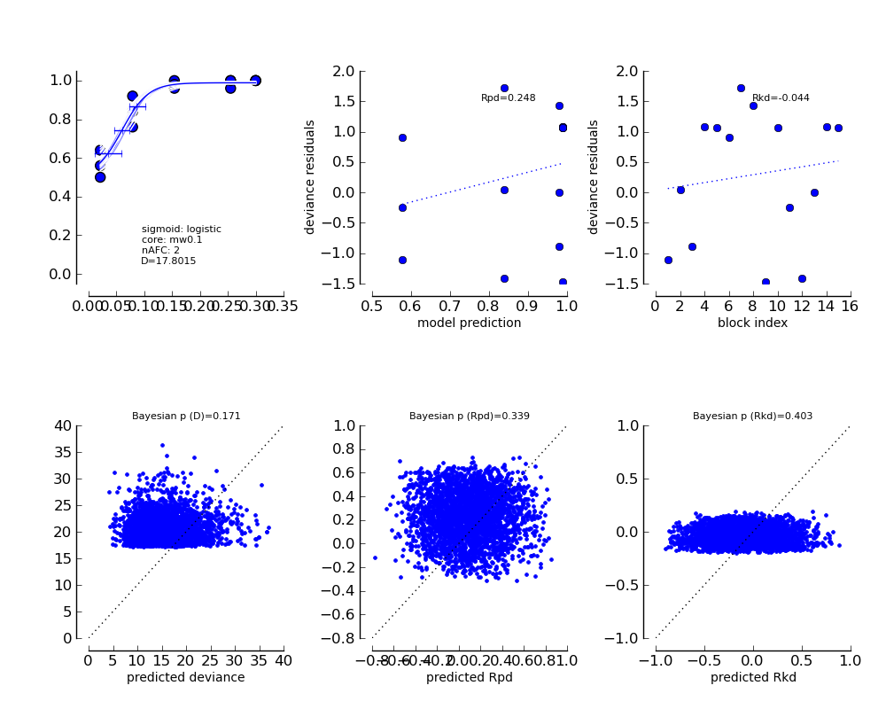
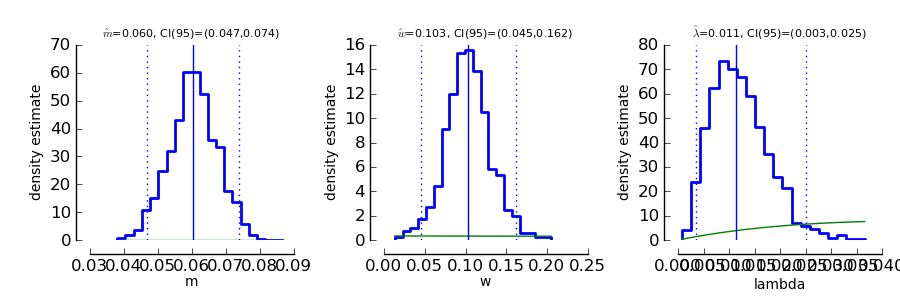

If you haven't generated the example dataset (same as in the Bootstrap section), you can find it :doc:`here </QUICKSTART>` .

Bayesian inference
==================

Bayesian inference follows a slightly different logic than conventional frequentist inference.

1. In a Bayesian framework, probability is used to quantify *uncertainty*. As the data are perfectly
   certain (we measured them), the data are typically considered fixed. In contrast, the parameters
   are uncertain (we don't know them). Thus, the parameters are modeled as random variables.
2. In a Bayesian framework, it is not common to simply consider a single value of a parameter.
   Instead, we want to get an idea of the so called 'posterior' distribution. That is the distribution
   of parameters (and the associated uncertainty about parameters) that is left after having
   observed the data. The posterior distribution is in most cases relatively easy to write down
   up to a constant factor. This gives rise to two problems

   * The posterior distribution is not a proper probability density function. In order to work
     with it as a probability distribution, we may want to normalize the posterior to have
     an integral of 1.

   * We need to summarize the potentially high dimensional posterior distribution. That means
     we are looking for expectations, quantiles, marginal distributions, ...

Bayesian methodology typically starts by quantifying the uncertainty about parameters in a
Situation when no data have been observed. The distribution describing this uncertainty is
called the *prior* distribution. We set up prior distributions for all parameters in the model (see `Bayesian model fitting and prior selection <http://psignifit.sourceforge.net/BAYESINTRO#Specification of Prior Distributions.html>`_. )

>>> priors = ( 'Gauss(0,5)', 'Gamma(1,3)', 'Beta(2,20)' )

Typically we don't know much about the parameters without having observed the data. Thus, we will
usually be looking for relatively flat priors that give equal probability to all parameter values.
These priors are *not flat*. They were chosen here to demonstrate the interaction between prior
and data in generating the posterior distribution.

In accordance with Kuss et al (2005), the default parameterization for psychometric functions for
Bayesian inference is the mw-parameterization. That means, the core object of the psychometric
function is defined in terms of a 'midpoint' :math:`m` of the sigmoid and the 'width' :math:`w`. As explained above
:math:`w` can be interpreted as the length of the interval on which :math:`F` rises from :math:`\alpha` to :math:`1-\alpha`. In
the default parameterization, :math:`\alpha=0.1`.

The priors we defined above say in words that

* We believe that the midpoint of the psychometric function will be somewhere around 0 with a variance
  of 5.

* We believe that the widths of the psychometric function is positive (the Gamma distribution is 0
  for negative values) and most probably somewhere around 3.

* We feel like having observed 50 trials in which 5% percent of trials were lapses.

More information about prior selection can be found in the section _`Bayesian model fitting and prior selection`.

We will now set up a data object that allows inference based on the posterior distribution of
parameters given the observed data.

>>> mcmc_single_sessions = psi.BayesInference ( data_single_sessions, priors=priors, nafc=nafc )
>>> mcmc_single_sessions.estimate
array([ 0.0601,  0.1029,  0.0114 ])
>>> mcmc_single_sessions.deviance
17.8015

As we can see, the BayesInference object knows a single number as an estimate for the parameters:
:math:`m` seems to be approximately 0.06, :math:`w` seems to be approximately 0.10 and the lapse rate :math:`\lambda` seems to
be somewhere around 0.011. These numbers are averages of the posterior distribution. How accurate are they? Can we trust in them?

Convergence diagnostics
-----------------------

As mentioned above in point 2, the posterior distribution that we can directly write down is only
proportional to the 'real' posterior probability distribution. The get an idea about the probability
distribution, the BayesInference object uses a technique called markov chain monte carlo (MCMC) to
draw samples from the posterior distribution. This simplifies a number of problems: Expectations reduce
to simple averages over the samples from the posterior distribution, quantiles of the posterior
distribution can be estimated as quantiles of the samples, ... Unfortunately this simplification
comes at a price. The sampling procedure steps from one sample to the next, to make sure that
eventually the samples are from the posterior distribution. In other words: The first M samples
are usually not from the posterior distribution but after that the typically are. Furthermore,
it is important to know whether the samples really cover the whole posterior distribution or
whether they remain in a restricted area of the posterior distribution. These points are summarized
under the term *convergence*. Although the BayesInference object will in most cases try to
use sensible parameters for the sampling procedure (using a procedure by [Raftery_and_Lewis_1996]_
to ensure these points, it might be that the chains did not converge.

A good strategy to access convergence is to simply use multiple chains and to check whether they
eventually sample from the same distribution. Currently, we have one chain of samples:

>>> mcmc_single_sessions.nchains
1

We draw two more chains from starting values that are relatively far away from our estimate above. 
If you are unsure about which values to take, you can use the extension .farstart to generate your starting values:

>>> mcmc_single_sessions.farstart
array([ 0.0610,  0.0489,  0.0098 ])
>>> mcmc_single_sessions.sample ( start= mcmc_single_sessions.farstart )

>>> mcmc_single_sessions.farstart
>>> mcmc_single_sessions.sample ( start= mcmc_single_sessions.farstart )

Now we should have three chains:

>>> mcmc_single_sessions.nchains
3

>>> mcmc_single_sessions.Rhat ( 0 )
1.0028

As we can see, now there are three chains. The last line compares all three chains. This value
is the variance between chains divided by the variance within chains as suggested by [Gelman_1996]_.
If there are large differences between chains, the variance between chains will
be very high and thus :math:`\hat{R}` will be very high, too. If :math:`\hat{R}` is larger than 1.1, this is typically an
indication, that the chains did not converge. In the example above, :math:`\hat{R}` is nearly exactly 1 for
parameter 0 (which is :math:`m`). Thus, we can be quite sure that the samples of :math:`m` where from the
posterior distribution of :math:`m`. To see the same for the other two parameters, :math:`w` and :math:`\lambda`, we can
say:

>>> mcmc_single_sessions.Rhat ( 1 )
0.99907409825082549
>>> mcmc_single_sessions.Rhat ( 2 )
1.021888809239619

Thus, all three chains seem to sample from at least the same distribution of parameters and we
conclude that it is very likely that this distribution is indeed the posterior distribution.
To get an even better idea, we can also look at a convergence plot:

>>> psi.ConvergenceMCMC ( mcmc_single_sessions )
>>> psi.show()

This plot consists of three panels. The first simply shows the three chains in three different
colors. These chains should look like a "hairy caterpillar" [Wetzels_and_Lee_2010]_ and they should not differ statistically
from each others.This seems to be the case. In addition, the plot shows The :math:`\hat{R}` estimate we had
already seen above.

The second plot in the middle shows a convergence criterion proposed by [Geweke_1992]_: Every chain
first Z-standardized to have mean 0 and standard deviation 1. Then the chain is split in 10 segments.
If one of these chains deviates more than two standard deviations from the mean, this is a sign
that the chain is not stationary. In that case, it might be that the chain does not sample the
whole posterior distribution, or does not sample the posterior distribution at all! In the middle
segment of our graphic, all chains seem to be reasonably stationary. Thus, there is good reason that
these chains really sample from the posterior distribution of parameters.

The third plot on the right shows the marginal posterior density estimated from all three chains
taken together (blue staircase curve). In addition, the prior density is plotted (green line) and
three vertical lines. The solid vertical line marks the posterior mean, the two dotted curves
mark the 2.5% and the 97.5% percentiles. This plot gives us a good idea of the posterior
distribution of m. There are no strange outliers or discontinuities. For our special case, this is
again good evidence that the chains really converged.

If we want to select a particular parameter to access convergence, we can use the parameter argument

>>> psi.ConvergenceMCMC ( mcmc_single_sessions, parameter=1 )
>>> psi.show()	

The plot is of course the same for the interpretation. However, in this case the prior is a
Gamma(1,3) distribution that is only defined for positive numbers. Again, the chains seem to have
converged. However, the data clearly indicate a width that is larger than the widths given by the
prior.

Goodness of fit
---------------

We can now use the same goodness of fit function as for the BootstrapInference object:

>>> psi.GoodnessOfFit ( mcmc_single_sessions )

The structure of the plot is very similar to the goodness of fit plot for the BootstrapInference
object. However, the interpretations should now be taken from a Bayesian perspective.

The upper left panel shows psychometric functions sampled from the posterior distribution, data, and
credibility intervals for three thresholds. Data and credibility intervals have essentially the
same interpretation as before. However, this time, we have multiple psychometric functions to describe
the data. The dark blue curve (on which the credibility bar are fixed) indicates the curve
corresponding to the mean of the psychometric function. The other curves in light blue with different
saturation correspond to samples from the posterior distribution. The saturation of the color of the curve
is proportional to the likelihood of the psychometric function, that is the part of the posterior
distribution that represents the influence of the data.

The plot on the lower left shows posterior predictive deviances. For each sample from the posterior
distribution, a data set has been generated. The deviance associated with the posterior samples and the
observed data set is plotted against the deviance of these simulated data sets for the psychometric
functions associated with the samples from the posterior distribution. If the observed data are
likely to come from the fitted model, all the  points in this plot should lie around the diagonal. If
the plots are mainly above the diagonal, the deviances of the observed data are higher than expected for
data the originate from the fitted model. It is possible to calculate a "Bayesian p-value" that lies
between 0 and 1. Values close to 0 or 1 indicate a bad fit in this case.

The two plots of posterior correlation between model prediction and deviance residuals and between block
index and deviance residuals are essentially the same as this plot. The only difference is, that
in this case it is not the deviance that is calculated for each posterior predictive sample but it is
the respective correlation. Interpretation of these plots is analog to the interpretation of the respective
plot for the posterior deviance.

We can observe that in all cases, the fitted model describes the data reasonably well.

For more information about the sensitivity of posterior predictive simulations in the setting of psychometric
functions refer to [Fruend_et_al_2011]_.

Posterior distributions
-----------------------

To get an idea of the posterior parameter distributions, we can again use the function

>>> psi.ParameterPlot ( mcmc_single_sessions )

resulting in plots of the estimated posterior density of all model parameters (blue staircase) as
well as the priors associated with the respective model parameters (green lines).

The interpretation of these plots is straightforward.
Also the ThresholdPlot() function that we applied to the bootstrap data in the first example can
be used for Bayesian inference.

References
----------
.. [Blackwell_1952] Blackwell, H. R.(1952). Studies of psychophysical methods for measuring visual thresholds. Journal of the Optical Society of America, 42, 606-616.
.. [Fruend_et_al_2011] Fründ, I, Haenel, NV, Wichmann, FA (2011). Inference for psychometric functions in the presence of nonstationary behavior. Journal of Vision, in press.
.. [Gelman_1996] Gelman A (1996): Inference and monitoring convergence. In [Gilks_et_al_1996]_.
.. [Geweke_1992] Geweke, J (1992): Evaluating the accuracy of sampling-based approaches to calculating posterior moments. In Bernardo et al., pp 169-193.
.. [Gilks_et_al_1996] Gilks, WR, Richardson, S, Spiegelhalter, DJ (Hrsg,1996): Markov chain Monte Carlo in practice. London: Chapman & Hall.
.. [Hill_2001] Hill, NJ (2001): Testing Hypotheses About Psychometric Functions. PhD Thesis, Oxford.
.. [Kuss_et_al_2005] Kuss, M, Jäkel, F, Wichmann, FA (2005): Bayesian inference for psychometric functions. J Vis, 5, 478-492.
.. [Raftery_and_Lewis_1996] Raftery & Lewis (1996): Implementing MCMC. In [Gilks_et_al_1996]_.
.. [Wichmann_and_Hill_2001a] Wichmann, FA, Hill, NJ (2001a): The psychometric function: I. Fitting, sampling, and goodness of fit. Perc Psychophys, 63(8), 1293-1313.
.. [Wetzels_and_Lee_2010] Wetzels, R., Lee, M. D., & Wagenmakers, E. (2010): Bayesian inference using WBDev: A tutorial for social scientists. Behavior Research Methods, 42(3), 884-897.
.. [Wichmann_and_Hill_2001b] Wichmann, FA, Hill, NJ (2001b): The psychometric function: II. Bootstrap-based confidence intervals and sampling. Perc Psychophys, 63(8), 1314-1329.

