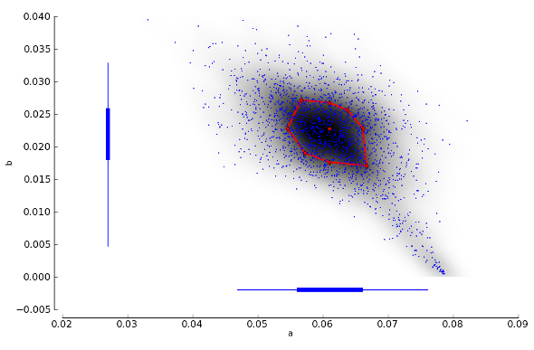
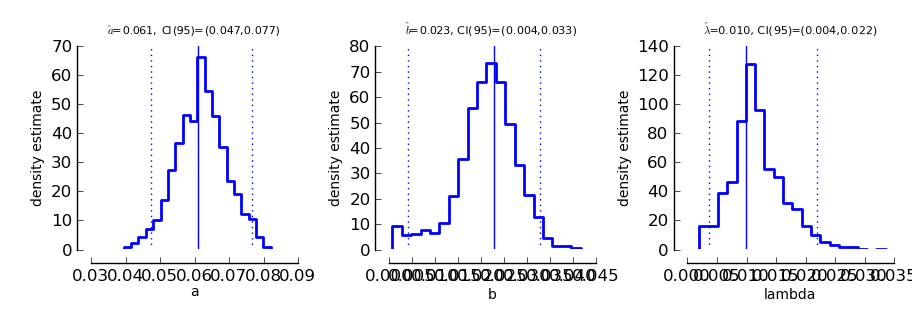
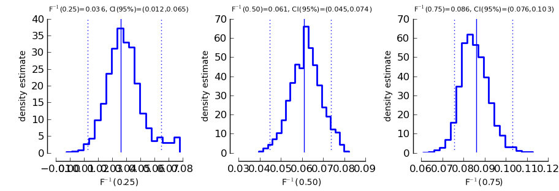
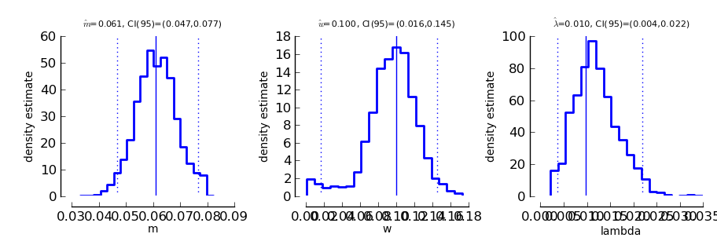

Constrained Maximum Likelihood and Bootstrap Inference
======================================================

We will guide you through a recommended workflow, consisting of:

* psychometric function fitting and parameter estimation
* assessment of goodness of fit
* sensitivity analysis for potential correction of confidence intervals (!! required for smaller datasets)

If you got here directly from the Table of Contents you should jump to the `quickstart </QUICKSTART>`_ in order to learn how to organize your data for subsequent fitting:

Fitting
-------
Constrained maximum likelihood provides a way to estimate parameters from a psychometric function
using maximum likelihood estimation while imposing constraints on some of the parameters.

Parameters:

* :math:`\gamma` is the guessing rate, or the lower asymptote
* :math:`\lambda` is the lapsing rate, or the upper asymptote
* :math:`a` and :math:`b` are parameters governing the shape of the sigmoid function and can be transformed into threshold and slope
* :math:`F` is a sigmoid function. Here we try to fit the data to a logistic function which is the default setting. 

For more information on different psychometric functions see `specifying the shape of the psychometric function <http://psignifit.sourceforge.net/MODELSPECIFICATION.html#specifiing-the-shape-of-the-psychometric-function>`_. 

For a 2AFC task, the guessing rate is fixed at :math:`\gamma=0.5`. Thus, our model has three free parameters:
:math:`a`, :math:`b`, and :math:`\lambda`. We want to keep :math:`a` and :math:`b` unconstrained. In order to constrain :math:`\lambda` the following considerations might be helpful:

* For observers who exhibit a low lapse rate :math:`\lambda` can be approximated by Beta(2,20).
* For observers who exhibit a high lapse rate (typically observed in animals) :math:`\lambda` can be approximated by Beta(1.5,12). For more information about prior selection you might read the `Introduction to Bayes Inference <http://psignifit.sourceforge.net/BAYESINTRO.html#>`_.

>>> nafc = 2
>>> constraints = ( 'unconstrained', 'unconstrained', 'Beta(2,20)' )

Now we can fit the psychometric function by calling:

>>> B_single_sessions = psi.BootstrapInference ( data_single_sessions, priors=constraints, nafc=nafc )

Note that all inference functions assume a 2AFC task by default. ``B_single_sessions`` is a Bootstrap Inference Object,

>>> print B_single_sessions
< BootstrapInference object with 15 blocks and 0 samples >

You can access estimates for all parameters by typing:

>>> B_single_sessions.estimate
array([ 0.06098965,  0.02276219,  0.00983442])

*  :math:`a` (threshold) is approximately 0.0610
*  :math:`b` (slope) is approximately 0.0228
*  :math:`\lambda` (lapse rate) is approximately 0.0097

You can also get the threshold and slope more directly:

>>> B_single_sessions.getThres()
0.060989653562317808

>>> B_single_sessions.getSlope()
10.983127014070762

>>> B_single_sessions.getThres(0.5)
0.060989653562317808

>>> B_single_sessions.getThres(0.75)
0.08599647282382343

Please not that ``.getThres()``, ``.getSlope()`` and ``.getCI()`` return by default their respective values at :math:`\Psi(x)=0.5`

.. _goodness_of_fit:

Goodness of fit assessment
--------------------------
How well do these parameters describe the data? The deviance is a measure that describes the goodness of fit for a model, based on the sum of the squares error metric. In our example, the deviance is approximately 17.4212.

>>> B_single_sessions.deviance
17.421204439061146

Is this a high or a low value? In order to decide whether or not the fitted function is a proper representation of the data the following bootstrap analysis of the deviance will be performed:

1. 2000 (default) sample data sets are generated using the fitted parameters as generating parameters and assuming that the data are binomially distributed
2. for each of these data sets a new deviance value is calculated relative to our fitted psychometric function
3. the sampled deviance values are sorted in order to determine 95% confidence intervalls (see goodness of fit output)

>>> B_single_sessions.sample()

>>> print B_single_sessions
< BootstrapInference object with 15 blocks and 2000 samples >

We see that ``B_single_sessions`` has changed: instead of 0 samples, we now have 2000 parametric bootstrap samples in the object. We can use these samples to assess the goodness of fit:

>>> psi.GoodnessOfFit(B_single_sessions)

In an interactive session, this should open a window that looks like the following. (In some
cases, you may have to type ``psi.show()`` before you see the window).

.. image:: gof_single_sessions.png

1. Top left: displays the given data points and the fitted psychometric function. Thresholds and confidence intervals are plotted at three levels (default: 25%, 50% and 75% ). Mind that the y-axis starts at 0.5 (the guess rate in a 2AFC task), therefore the 50% threshold is located at :math:`\Psi(x) = .75`. :math:`D` signifies the deviance value.

2. Bottom left: histogram of bootstrapped deviance values (default = 2000 samples). The 95% confidence limits are indicated by red dotted lines and the actually observed deviance is indicated by the solid red line. If the observed deviance is outside the 95% confidence limits that indicates a bad fit and you will receive a warning message.

3. Top middle: deviance residuals are plotted as a function of the predicted correct response rate of the model (x-axis corresponds to y-axis in panel 1). This plot helps you to detect systematic deviations between the model and the data. The dotted line is the best linear fit that relates deviance residuals to the predicted correct response rate. Rpd gives the numerical value of that correlation. Note that the residuals are scaled to account for differences in the variability of a binomially distributed random variable (e.g. maximum variance at p=0.5).

4. Bottom middle: histogram of bootstrapped correlation coefficients for the correlation between residuals and performance level (same logic applies as in panel 2). Dotted lines denote 95% intervals of the sampled correlation coefficients, the solid line marks the observed correlation between model prediction and deviance residuals.

5. Top right: deviance residuals are plotted as a function of block index i.e. the sequence in which the data were acquired (WARNING: this graph can be properly interpreted only when stimulus intensities were fixed in separate blocks). If the observer was learning, the fitted linear correlation between residuals and block index should be positive.

6. Bottom right: histogram of bootstrapped correlation coefficients for the correlation between deviance residuals and block index (same logic applies as in panel 2 and 4).

More information about these parameters can also be found in the paper by [Fruend_et_al_2011]_.

Sensitivity Analysis
--------------------

As noted by [Wichmann_and_Hill_2001b]_, bootstrap based confidence intervals might be too small. That would mean that a 95% confidence interval would contain the true parameter in less than 95% of the cases. It also means that you are more likely to make a Type I or alpha error, which is that you are more likely to deem two parameters to significantly differ from each other when in fact they don't.

We suggest to perform a Sensitivity Analysis on the BootstrapInference object. If necessary, confidence intervals will be expanded following the sensitivity analysis to compensate for the underestimation. If you compare the estimated confidence intervals before and after the analysis you will get an idea how stable your confidence interval estimates are:

>>> B_single_sessions.getCI(0.5)
array([ 0.04655731,  0.07565797])
>>> plotSensitivity(B)
>>> B_single_sessions.getCI(0.5)
array([-5.35198839,  0.07944721])

As you see in our example the second call to the getCI() method returns considerably wider confidence intervals. These confidence intervals have been enlarged to provide a more realistic coverage. In addition, the plotSensitivity() function should open a plot window showing something like this:

This shows the joint probability distribution of the parameters :math:`a` and :math:`b` of the model. The dark shading indicates the density of this joint distribution as estimated from the bootstrap parameters. The red dot in the center of the cloud of points is the parameter estimate that was determined by maximum likelihood. The red diamonds that are connected by red lines are the points at which an additional bootstrap sample has been drawn. The expanded bootstrap confidence intervals correspond to the widest confidence intervals from all points that are marked in red (i.e. the maximum likelihood estimate and the points marked by the red diamonds).

Parameter plots
---------------

We can also get a graphical representation of the fitted parameters:

>>> psi.ParameterPlot(B_single_sessions)

this should open a graph similar to the one depicted below (again, you might have to type psi.show() to open the plot window). Please note that for illustrative purposes this and the following plot are generated with the B_single_sessions object before the Sensitivity Analysis.

Each of these plots shows the estimated density of one of the model parameters. In addition,
the estimated parameter is marked by a solid vertical line and the 95% confidence interval is
marked by dotted vertical lines. The confidence interval limits and the estimates are written
on top of the graph.

In some cases, we may not directly be interested in the parameters of the model. Instead, we
ask for "thresholds", that is predefined performance levels of the sigmoid :math:`F`. We can get a plot
of such thresholds and the associated confidence intervals using the function

>>> psi.ThresholdPlot(B_single_sessions)

The plots show estimated densities for thresholds at  looks essentially the same as for the ParameterPlot only that this time, the threshold(s) of the model are displayed.

Reparameterizing the model
--------------------------

Psignifit3.0 reformulates the function :math:`F ( x | a,b )` by means of two separate functions :math:`f: R \to R` and :math:`g: R^3 \to R`. We can think of :math:`f` as the nonlinear part of the psychometric function, while :math:`g` is in most cases linear in :math:`x`. Often :math:`g` can be changed without seriously altering the possible model shapes. In pypsignifit :math:`f` is called the 'sigmoid' and :math:`g` is called the 'core'. Using different combinations of sigmoid and core allows a high flexibility of model fitting. For instance, Kuss et al. (2005) used a parameterization in terms of the 'midpoint' :math:`m` of the sigmoid and the 'width' :math:`w`. Here width is defined as the distance :math:`F^{-1} ( 1-\alpha ) - F^{-1} ( \alpha )`. To perform BootstrapInference for this model we can proceed as follows

>>> B_single_sessions_mw = psi.BootstrapInference ( data_single_sessions, sample=2000, priors=constraints, core="mw0.1", nafc=nafc )
>>> B_single_sessions_mw.estimate
array([ 0.061001  ,  0.10004294,  0.00982475])
>>> B_single_sessions_mw.deviance
17.419559245740842
>>> B_single_sessions_mw.getThres()
0.061001001373125807
>>> B_single_sessions_mw.cuts
(0.25, 0.5, 0.75)
>>> B_single_sessions_mw.getCI(0.5)
array([ 1.4842732 ,  4.06407509])

Note that this model has the same deviance as the model fitted above. Also the obtained thresholds are the same. However, as the parameterization is different, the actual fitted parameter values are different as can be seen in the following plot:

>>> psi.ParameterPlot(B_single_sessions_mw)

More details on sigmoids and cores and how they can be used to specify models can be found in the section about _`Specification of Models for Psychometric functions`

References
----------
.. [Blackwell_1952] Blackwell, H. R.(1952). Studies of psychophysical methods for measuring visual thresholds. Journal of the Optical Society of America, 42, 606-616.
.. [Fruend_et_al_2011] Fründ, I, Haenel, NV, Wichmann, FA (2011). Inference for psychometric functions in the presence of nonstationary behavior. Journal of Vision, in press.
.. [Gelman_1996] Gelman A (1996): Inference and monitoring convergence. In [Gilks_et_al_1996]_.
.. [Geweke_1992] Geweke, J (1992): Evaluating the accuracy of sampling-based approaches to calculating posterior moments. In Bernardo et al., pp 169-193.
.. [Gilks_et_al_1996] Gilks, WR, Richardson, S, Spiegelhalter, DJ (Hrsg,1996): Markov chain Monte Carlo in practice. London: Chapman & Hall.
.. [Hill_2001] Hill, NJ (2001): Testing Hypotheses About Psychometric Functions. PhD Thesis, Oxford.
.. [Kuss_et_al_2005] Kuss, M, Jäkel, F, Wichmann, FA (2005): Bayesian inference for psychometric functions. J Vis, 5, 478-492.
.. [Raftery_and_Lewis_1996] Raftery & Lewis (1996): Implementing MCMC. In [Gilks_et_al_1996]_.
.. [Wichmann_and_Hill_2001a] Wichmann, FA, Hill, NJ (2001a): The psychometric function: I. Fitting, sampling, and goodness of fit. Perc Psychophys, 63(8), 1293-1313.
.. [Wichmann_and_Hill_2001b] Wichmann, FA, Hill, NJ (2001b): The psychometric function: II. Bootstrap-based confidence intervals and sampling. Perc Psychophys, 63(8), 1314-1329.

